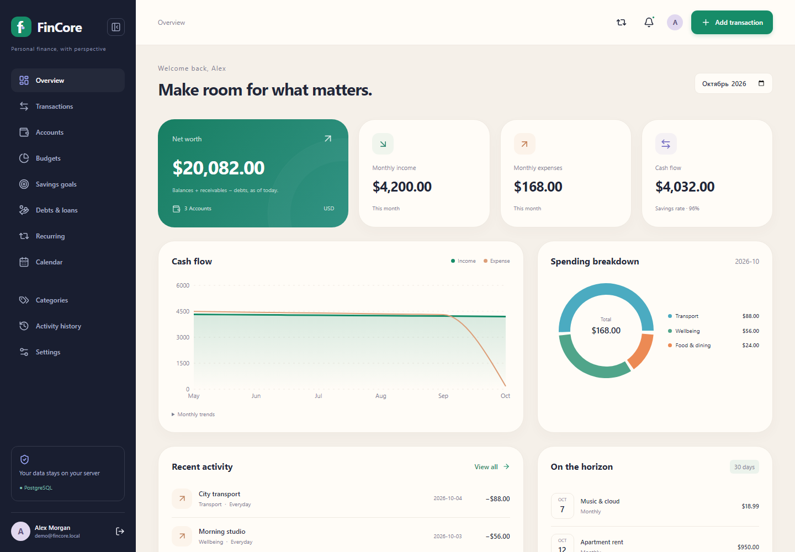
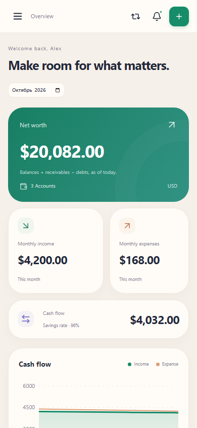

# FinCore

### Personal finance, with perspective.

[](https://nextjs.org/)
[](https://www.typescriptlang.org/)
[](https://www.postgresql.org/)
[](LICENSE)

FinCore is a self-hosted personal finance web app for tracking accounts, understanding spending and planning ahead. It runs on Node.js, PostgreSQL and your own disk, without bank integrations, cloud storage accounts or external API keys.

Built as **Day 12 of the 15 Days of Code challenge**.



<details>
<summary>Mobile preview</summary>
<br />

</details>

## At a glance

| Track | Plan | Understand | Personalize |
| --- | --- | --- | --- |
| Accounts, income, expenses and transfers | Budgets, savings goals, debts and recurring payments | Net worth, cash flow, trends and spending charts | 15 locales, RTL, themes, visual styles and accent colors |

The desktop sidebar collapses into a compact icon menu and remembers your preference. The language selected before signing in carries through to your profile.

## Start locally

Requirements: Node.js 22.12+ (tested on 24.21), npm, Docker Desktop with Compose, or PostgreSQL 17+. Internet is required once to install npm dependencies and the PostgreSQL container image. The app itself needs no external service.

Clone the repository and enter its directory:

```sh
git clone https://github.com/mnerst1/FinCore.git
cd FinCore
```

Create your local environment and start the database, then install and initialize the app:

```powershell
Copy-Item .env.example .env
docker compose up -d --wait
npm ci
npm run db:generate
npm run db:migrate
npm run db:seed
npm run dev
```

On macOS/Linux replace the first command with `cp .env.example .env`.

Open **http://localhost:3000**. Use this hostname, because `APP_URL` checks the exact request origin.

Click **Login to demo account** on the sign-in screen to explore the seeded profile. Manual demo login: **demo@fincore.local** / **FinCore-Demo-2026!**. `DEMO_PASSWORD` overrides the seed password. Seed is explicit and idempotent: rerunning it never resets an existing demo profile. New registrations start with default categories and no invented account balances.

For a production build on the same machine, stop the development server first (especially on Windows, where Prisma locks its loaded engine DLL):

```sh
npm run build
npm start
```

For an existing PostgreSQL instance, create a database and a user that owns it, update `DATABASE_URL` in `.env`, skip Docker, and run the remaining commands. `POSTGRES_PASSWORD` and the password inside `DATABASE_URL` must agree when using Compose. The sample database password is a local development value, not a deployment secret.

## Working features

- Register, sign in/out, edit profile, change password and revoke all sessions.
- Bank, cash, savings, investment and credit accounts with signed opening balances.
- Income, expenses and transfers; edit/delete operations; search notes/descriptions; filter by account, category, type and dates; sort by date or amount.
- Category trees with cycle prevention; monthly category budgets including descendant spending.
- Savings targets with allocated totals, deadline and progress.
- Borrowed/lent principal, interest-rate annotation, deadline, atomic principal payment linked to an account transaction. Deleting that payment reverses its debt adjustment.
- Daily, weekly, monthly and yearly recurring income/expenses. Month-end anchors survive February. Processing is concurrency-safe and idempotent.
- Calendar, cashflow, six-month trends, spending donut, net worth and upcoming recurring payments.
- Local reminders for due payments, debts, savings deadlines and budgets reaching 80%. Read/unread state and activity history.
- PDF/PNG/JPEG receipts, file picker and drag/drop, authorized downloads and deletion, up to 5 MB per receipt and 10 receipts per operation.
- CSV export/import; JSON financial backup/restore **including receipt contents**.
- Light/Dark/System; Clean/Glass/Minimal/Contrast/Soft; seven preset accents and a color picker.
- Responsive screens, accessible Radix dialogs, keyboard focus, loading skeletons, empty states, toast feedback, reduced-motion support, chart data tables.

## Accounting rules

One profile uses **one base currency**. Account types describe accounts; they do not connect to banks. Opening balances represent the starting point, so enter historical transactions only when they are not already included in those balances. Transfers subtract from one account and add to the other, and are excluded from income/expense charts. Negative balances are permitted.

Balances and charts exclude transactions after today's UTC calendar date. Calendar and transaction lists include scheduled future entries. Net worth is current account balances + outstanding receivables − outstanding debts; avoid recording the same liability both as a negative credit opening balance and as a separate debt.

Savings allocations are a planning layer and do not create money or move funds. Use a transfer to move money into a savings account. Loans track principal, not automatic amortization or interest accrual; enter interest charges separately. Principal repayments are cash movements and appear in cashflow, but decrease the matching liability/receivable. Repayments cannot be dated in the future. Debt balances are current snapshots, not historical snapshots for a selected month.

Amounts use PostgreSQL `Decimal(18,2)` and validated two-decimal inputs. Graph aggregation uses integer cents. Dates are date-only; scheduler processing uses UTC. The app is intended for personal datasets, not millions of ledger rows: the dashboard loads the user's full ledger.

## Recurring processing & reminders

Opening the signed-in app, clicking Refresh or **Process due payments** posts due recurring entries and updates reminders. Closed applications need a local scheduler:

```sh
npm run recurring
```

Run that command daily using Windows Task Scheduler or cron, with the project folder as the working directory. Each rule processes at most 400 missed occurrences per pass; run another pass for a longer backlog. The command requires the same `.env` and database as the app. Deleting a posted recurring operation removes that entry; it does not rewind the rule's next date. Reminders are in-app only, and remain in history until marked read. There is no email/push integration.

## Import and backup

The CSV header is:

```csv
date,kind,amount,description,account,toAccount,category,note
2026-10-04,expense,25.50,Lunch,Everyday,,Food & dining,
```

Dates use `YYYY-MM-DD`, amounts use a decimal dot without currency symbols, kinds use `income`, `expense`, `transfer`. Account/category names must match existing **unambiguous** names. `toAccount` is required for transfers. An invalid row rolls back the whole import. Limit: 2 MB and 2,000 rows. Imports append; importing twice duplicates data. Export protects spreadsheet cells from formula interpretation; use JSON for lossless backups, because formula-shaped CSV text receives a leading apostrophe.

JSON is a versioned `fincore-v1` financial snapshot, max 64 MB. It includes accounts, category trees, transactions, budgets, goals, debts, recurring rules and base64 receipt contents. It excludes passwords, sessions, preferences, activity and notification history. Restore into a profile with no accounts, budgets, goals or debts and the same base currency. Existing empty-profile categories are replaced. IDs and receipt filenames are remapped; a failed restore rolls back database changes and removes newly written files. This preserves finances and attachments, not the previous login identity. Do not manually edit the backup.

For a full instance backup, stop app/scheduler writes, use `pg_dump` and copy the `uploads/` directory. Keep the dump and files from the same point in time. JSON backups contain personal financial data and should be stored privately. Docker volumes persist when `docker compose down` is used; `down -v` destroys the database.

## Languages — honest coverage

**English, Russian and Kazakh** contain all interface keys. Twelve additional languages translate the core navigation, login and financial labels: Spanish, French, German, Portuguese, Italian, Turkish, Arabic, Simplified Chinese, Japanese, Korean, Hindi and Ukrainian. There are **15** locales total. Other labels in those locales fall back to English; Settings shows the measured key coverage and explicitly labels them partial. Arabic uses RTL for the page, sidebar, dialogs and logical spacing. User-created names and demo records are data, not translated interface strings.

`src/locales/{en,ru,kk}.json` are complete dictionaries; `world.json` contains the additional core dictionaries. Add a locale dictionary and register its native name/direction in `src/lib/i18n.ts`. Intl formats currencies/months/dates; CSS uses logical properties. Universal language support is not claimed. Translations have automated key coverage checks, but no independent native-speaker review.

## Architecture and security

```text
src/app/                 App Router pages, loading/error states, API handlers
src/components/          shell, domain screens, dialogs, charts, settings
src/lib/                 finance, validation, services, recurrence, auth, storage, portability
src/locales/             interface dictionaries
prisma/schema.prisma     relational model and explicit indexes
prisma/migrations/       committed PostgreSQL migration
prisma/seed.ts           opt-in demo data
scripts/recurring.ts     local scheduler entry point
tests/                   unit, PostgreSQL integration, browser scenarios
```

Route handlers authenticate every private request. Mutations check ownership, related-record ownership, schema validation, and an exact `Origin` match against `APP_URL`. Scrypt uses random salts; opaque 256-bit session tokens are stored only as SHA-256 digests in PostgreSQL, with seven-day expiration. Cookies use HttpOnly and SameSite=Strict, with Secure enabled for HTTPS `APP_URL`. Password changes invalidate all sessions. Login/register rate limits persist in PostgreSQL per normalized email (10 attempts/15 minutes); no untrusted forwarded-IP headers are used. Parameterized Prisma queries and parameterized advisory locks protect mutation consistency. Receipts use signature checks, randomized disk names, authenticated download routes and forced attachment disposition. Files are never served as public static assets.

The default server and database bind to loopback. For hosting later, use HTTPS, a matching `APP_URL`, private credentials, a trusted reverse proxy and operational backups. CSP allows inline scripts/styles required by the framework; development alone permits eval. This is not an audited banking system. There is no email verification/password recovery service, bank synchronization, exchange-rate feed, encrypted-at-rest vault or automatic loan interest engine.

## Checks

```sh
npm run lint
npm run typecheck
npm test
npm run test:integration
npx playwright install chromium
npm run test:e2e
npm run build
```

Integration tests require a migrated PostgreSQL database in `DATABASE_URL`; they create and delete only their own test users. Browser tests require migrated/seeded data and create test accounts that remain until removed manually. Run against a development/test database. `E2E_URL` overrides the default browser URL; `APP_URL` must match. See [TEST_CHECKLIST.md](TEST_CHECKLIST.md) and [VALIDATION.md](VALIDATION.md).

Reference documentation: [Next.js route handlers](https://nextjs.org/docs/app/getting-started/route-handlers), [Next.js cookies](https://nextjs.org/docs/app/api-reference/functions/cookies), [Prisma 6 migrations](https://docs.prisma.io/docs/orm/v6/prisma-migrate/getting-started).

## License

MIT. See [LICENSE](LICENSE). Third-party dependencies retain their respective licenses.
